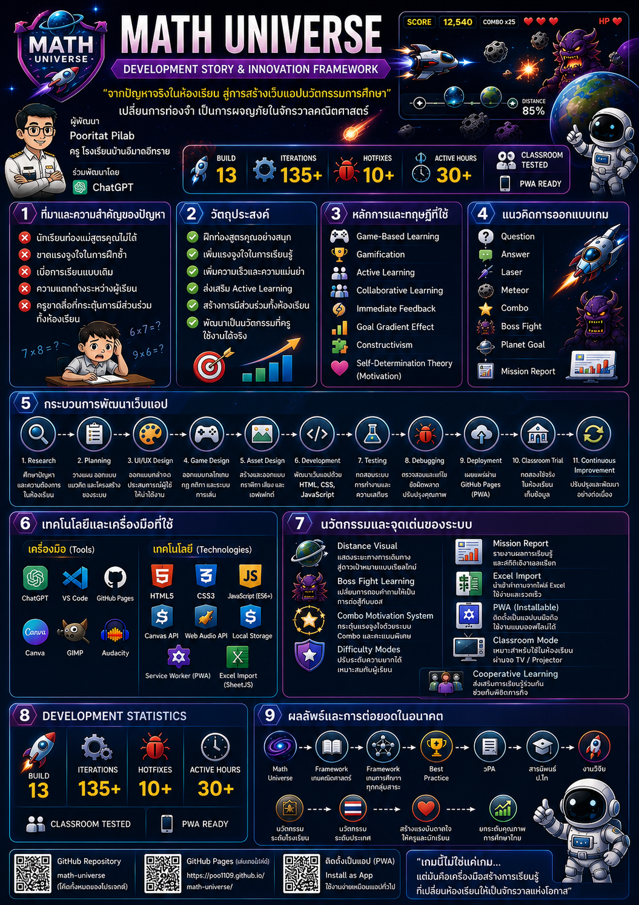
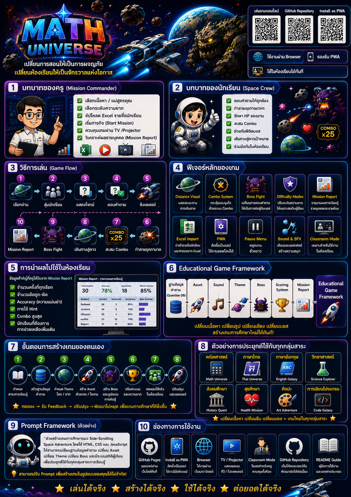

# 🌌 Math Universe Complete Edition

เกมท่องสูตรคูณ พิชิตจักรวาลคณิตศาสตร์  
**Production Classroom Edition**  
Developed by **Pooritat Pilab × ChatGPT**

## 🎮 About

Math Universe เป็นเว็บแอปเกมการศึกษาแนว Side-Scrolling Space Adventure สำหรับฝึกทักษะการท่องสูตรคูณผ่านการสุ่มนักเรียน ตอบคำถาม ยิงเลเซอร์ ทำลายอุกกาบาต เดินทางสู่ดาวเป้าหมาย และต่อสู้กับบอสประจำด่าน

## 🚀 Development Story & Innovation Framework

## 👨‍🏫 User Guide & Educational Game Framework

## ✨ Key Features

- Difficulty Modes: Easy / Normal / Hard / Hell
- Distance Visual
- Boss Fight Learning
- Combo Motivation System
- Shield / HP System
- Mission Report พร้อมตารางรายชื่อนักเรียนแบบ Scroll
- Excel Import สำหรับรายชื่อนักเรียน
- Pause Menu Complete
- PWA พร้อมติดตั้งบนอุปกรณ์
- Classroom Mode สำหรับใช้งานผ่าน TV / Projector

## 📊 Development Statistics

- 🚀 Build 13 Based Complete Edition
- 🛠️ 135+ Iterations
- 🐞 10+ Hotfixes
- ⏱️ 30+ Active Development Hours
- 👨‍🏫 Classroom Tested
- 📱 PWA Ready

## 📱 วิธีใช้งาน

1. เปิด `index.html` หรือเผยแพร่ผ่าน GitHub Pages
2. กรอกชื่อผู้บัญชาการ ชื่อยาน และชั้น/ห้อง
3. เลือกระดับความยาก
4. อัปโหลดไฟล์ Excel รายชื่อนักเรียน
5. เริ่มภารกิจ
6. ดู Mission Report หลังจบด่าน

## 🏆 Credits

**Math Universe Complete Edition**  
Developed by **Pooritat Pilab**  
Co-developed with **ChatGPT**  
โรงเรียนบ้านอีมาดอีทราย
